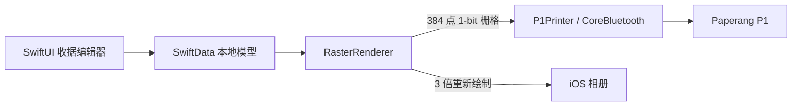

# Stub 架构说明

> 本文只记录稳定架构。新会话的阅读和检查顺序以仓库根目录 `AGENTS.md` 为准。

## 1. 系统概览

Stub 是一个 iOS 17+ 原生应用，用收据风格编辑每日 Todo，并直接连接 Paperang P1（喵喵机）打印。应用不需要账号、服务器或 iCloud；数据保存在本机，IPA 主要通过 AltStore 安装。



主要技术：SwiftUI、SwiftData、CoreBluetooth、Photos、UIKit/Core Graphics。

## 2. 数据与界面

SwiftData 模型定义在 `Stub/Models/ReceiptModels.swift`：

- `ReceiptDocument`：品牌、副标题、日期、口号、时间戳和三个分组。
- `TodoSection`：`mustDo`、`tryTodo`、`routine`，各自保存标题、副标题、顺序和任务。
- `TodoItem`：任务名、时长/次数、完成状态、`0...1` 进度和顺序。
- `PrintHistoryEntry`：只在打印真正完成后记录；保存相册不写打印历史。

`ContentView` 读取最近更新的收据；不存在时创建默认文档。`ReceiptEditorView` 负责编辑、每日重置、打印、相册保存和打印机管理。

重要行为：

- 每天日期变化后清空任务，保留三个空分组，为新一天重新规划。
- 默认口号从固定英文列表随机选择。
- 勾选任务会把进度设为 100%；取消勾选只取消完成标记，不回退进度。
- 进度显示为固定宽度的 `[████░░░░░░]  40%`，百分比补齐三位，保证列对齐。
- `PrintActionBar` 根据空闲、打印中和可取消状态展示相应操作；具体按钮主次和排列属于产品决策，见 `decisions.md`。

## 3. 收据渲染

`Stub/Printing/RasterRenderer.swift` 是打印和相册的共同内容源：

- `renderImage(document:scale:)` 使用 UIKit/Core Graphics 绘制收据。
- `scale = 1` 生成 384 点宽打印源。
- `scale = 3` 在高分辨率画布上重新绘制文字和线条后保存到相册；不是把 384 点图片做最近邻放大。
- `render(document:)` 将 `scale = 1` 的图片阈值化并打包为 P1 使用的每行 48 字节、1-bit 位图。
- 黑色像素为 `1`，每字节 MSB-first；打包时反转整行和行序，以抵消 P1 打印头方向和 Core Graphics 坐标方向。

屏幕预览由 SwiftUI 实现，打印/相册由 Core Graphics 实现，两者不是同一棵视图树。内容边距、任务列宽、列间距和文字垂直对齐构成两条渲染路径的共享布局契约；具体取值以代码和测试为事实来源，决策原因见 `decisions.md`。

已知技术债：屏幕与输出仍由两套布局代码绘制。以后调整 UI 时，必须同步检查 `RasterRenderer` 并用共享布局常量或快照测试约束。

## 4. Paperang P1 打印链路

`P1Protocol` 负责纯协议编码/解析，`P1Printer` 负责 CoreBluetooth 生命周期和流控，`PrintCoordinator` 负责 UI 状态。

连接流程：

1. 等待蓝牙可用。
2. 扫描所有 BLE 外设并按名称 `Paperang` 过滤；P1 不在 iOS 系统蓝牙列表中配对。
3. 连接后发现 FF00 和辅助服务。
4. 订阅 FF01 协议响应、FF03 credit/块大小和辅助通知。
5. 等待 FF03 报告 100 字节写入块大小。
6. 发送官方 App 抓包得到的认证前导包、注册随机 CRC32 会话密钥并初始化。
7. 将图像协议流切成 100 字节块，通过 FF02 `withoutResponse` 写入；每次写入前等待 FF03 credit。
8. 发送最终走纸并等待响应，然后断开。

协议帧格式：

```text
02 | command | sequence | payloadLength UInt16 LE | payload | CRC32 UInt32 LE | 03
```

CRC32 只覆盖 payload，使用会话 seed；不能替换成普通无 seed CRC32。认证前导包是 P1 协议常量，不包含用户账号、指纹或 Apple 身份信息，换同型号 P1 也应可用。

## 5. 设备管理与取消

- 电量读取：请求 `0x10`，响应 `0x11`。
- 自动关机读取：请求 `0x1F`，响应 `0x20`。
- 自动关机设置：请求 `0x1E`，payload 为秒数的 UInt16 little-endian；部分固件不返回设置响应，因此写入后用 `0x1F` 回读确认。
- 预设：3、10、30、60、180、300、600 分钟及不自动关闭。
- 打印取消会停止扫描、断开连接并恢复所有 continuation；已交给 BLE 控制器的数据无法撤回，可能留下少量残缺内容。

## 6. 构建、测试与发布

- 工程：`Stub.xcodeproj`，scheme：`Stub`。
- 最低系统：iOS 17。
- 单元测试集中在 `StubTests/P1ProtocolTests.swift`，覆盖协议帧、CRC、走纸、关机值、进度行为和关键渲染坐标。
- `scripts/build_ipa.sh` 默认生成未签名 `dist/Stub.ipa`，由 AltStore 重新签名。
- `.github/workflows/build-ipa-release.yml` 在推送 `v*` 标签时构建 IPA 并创建 GitHub Release。

构建、验收和提交的协作流程以根目录 `AGENTS.md` 为准。
